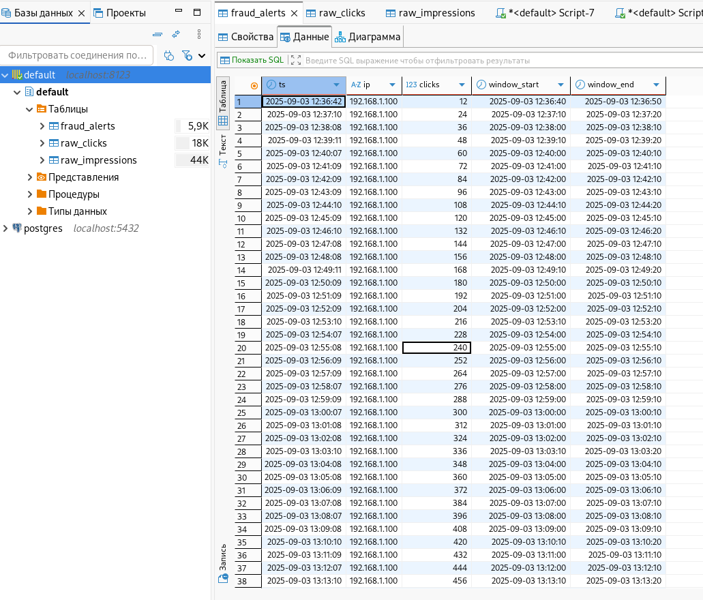
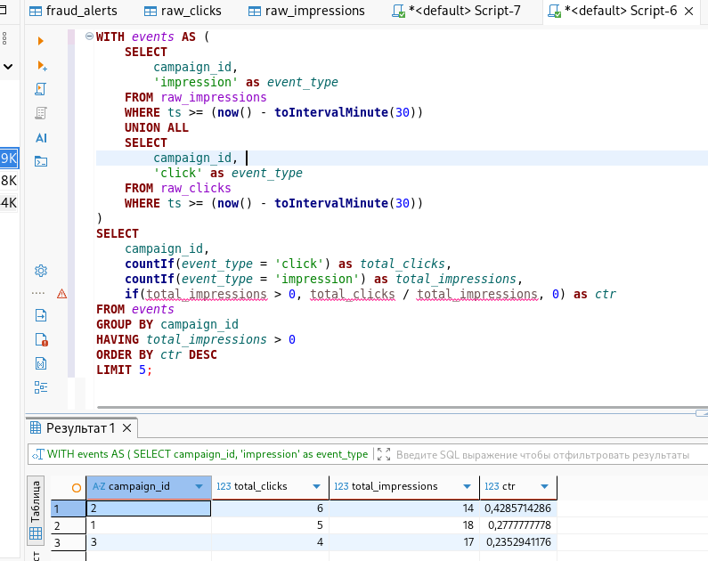

# Airflow Test Work

Проект для обработки рекламных данных с использованием Apache Airflow и ClickHouse.

### Исходные таблицы:
- **raw_impressions** - данные о показах рекламы
- **raw_clicks** - данные о кликах по рекламе

### Результирующие таблицы:
- **fraud_alerts** - обнаруженные мошеннические активности

## 🚀 Быстрый старт

## Connections создаются сами, файлы данных генерируются в даге

### 1. Запуск инфраструктуры:
```bash
docker compose up airflow-init
docker compose up -d
```

## Доступ в airflow (логин: airflow, пароль: airflow)

http://localhost:8080

## Проверить что данные загружаются, можно подключиться к clickhouse, например через dbeaver

Хост: localhost

Схема: default

Порт: 8123

Пользователь: clickhouse_user

Пароль: clickhouse_password





